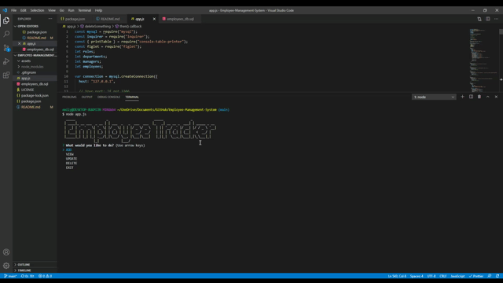

<h1 align="center">Employee Management System</h1>
  
[](https://opensource.org/licenses/MIT)

## Table of Contents
  - [Description](#description)
  - [Demo](#demo)
  - [Installation](#installation)
  - [Usage](#usage)
  - [Contributors](#contributors)
  - [Tests](#tests)
  - [License](#license)
  - [Technologies](#technologies)
  - [Questions](#questions)
  
  ## Description
  The Employee Management System was built to create an interface that makes it easier for non-developers to view and interact with the information stored in the employees_db. In this application, I built a solution for managing a company's employees using Node, Inquirer, and MySQL. As a business owner, you will be able to view and manage the departments, roles, and employees in your company so you can organize and plan your business.
  
  ## Demo
  
  
  To view the full demo, please direct yourself to ```assests``` folder.
  
  ## Installation
 ``` 
 node i inquirer
  ```
   ``` 
 node i MySQL
  ```
 ``` 
 node i figlet 
 ```
 
  Once all third-party packages have been successfully installed, the application is ready to use. For more details, reference the application's ```package.json``` file.
  
  ## Usage
  To launch the application from the command line, navigate to the project's root directory and run:
  ```
  node app.js
  ```
  The application begins by prompting the user to choose between adding, viewing, updating, or deleting the business's employees, roles, or departments. Whatever the user chooses to do, the database that corresponds will be updated accordingly. 
 
  ## Contributors
  Emily B. Todt
 
  ## Tests
  No tests were included.
  
  ## License
        Copyright (c) 2021 Emily B. Todt 
        Licensed under the [MIT license](https://opensource.org/licenses/MIT).
  
  ## Technologies
  JavaScript, Node.js, MySQL
  
  ## Questions
  Reach me on [GitHub](https://www.github.com/todtsies)  
  Reach me via email at <emilybtodt@gmail.com>